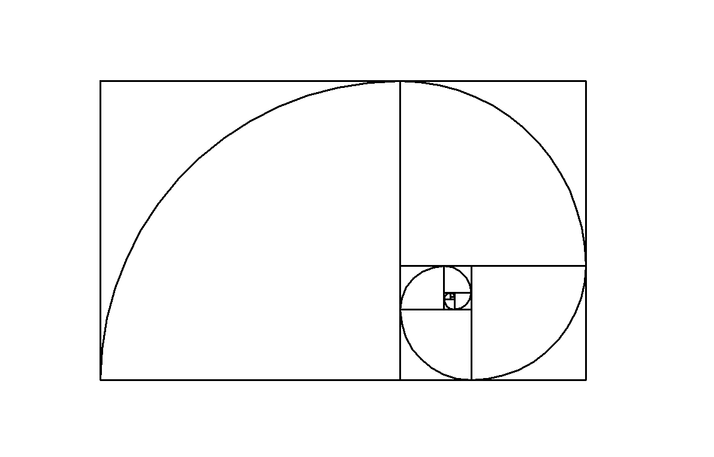

# Golden-Spiral

This code was made on Python to celebrate the Fibonacci day (11/23) since November 11th represents the first 4 numbers of the sequence.
I made a code that shows the nth number of the Fibonacci sequence and I also made a script to draw the Golden Spiral inside the Golden Rectangle that follows the golden ratio (a lot of golden). I used the built-in Turtle Graphics module to draw on Python.
I'm submitting this a few days late because I couldn't finish it on time haha, but at least it's way better than the version I made last year, you can find it on my Youtube Channel: [https://www.youtube.com/@pirraio](Pirraio).
